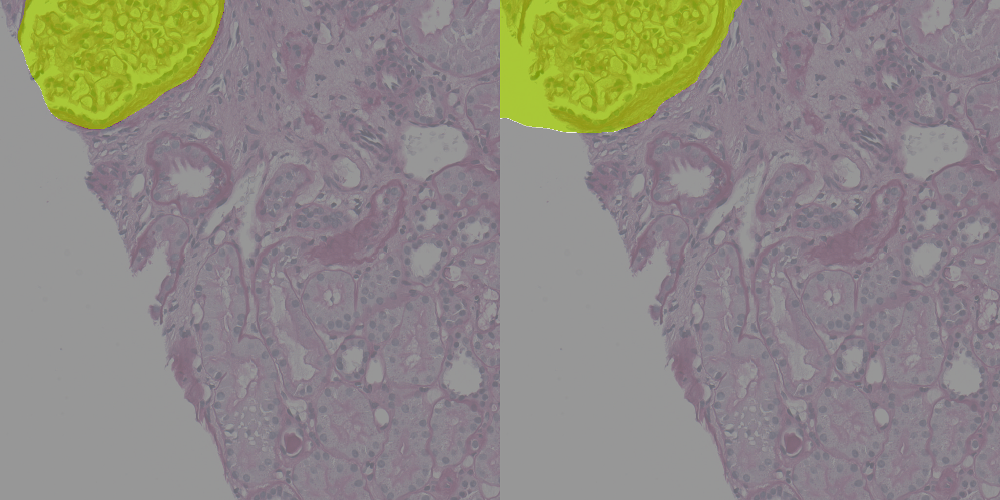

## 作业描述
使用mmseg进行组织病理切片小鼠肾小球数据集的分割

## 实验设备
GTX2060

## [组织病理切片小鼠肾小球数据集](https://zihao-openmmlab.obs.cn-east-3.myhuaweicloud.com/20230130-mmseg/dataset/Glomeruli-dataset.zip)

## 使用lraspp进行分割
- 模型指标

|        Model        | mIOU  | mACC  |                             Config                              |                                Download                                 |
|:-------------------:|:-----:|:-----:|:---------------------------------------------------------------:|:-----------------------------------------------------------------------:|
| lraspp(mobilenetV3) | 0.704 | 0.812 | [config](./mobilenet-v3-d8_lraspp_1xb4-2k_glomeruli-256x256.py) | [model](./mobilenet-v3-d8_lraspp_1xb4-2k_glomeruli-256x256_it_8000.pth) |

|   Class    |  IoU  |  Acc  |
|:----------:|:-----:|:-----:|
| background | 98.35 | 99.05 |
| glomeruili | 42.45 | 63.33 |

## 效果图

